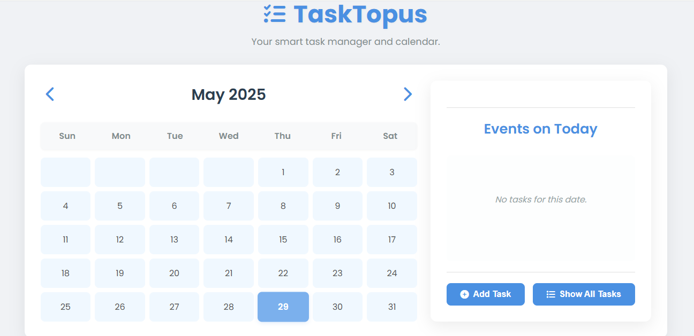

# tasktopus
Your smart task manager and calendar (A to do list project)

This is a dynamic and interactive web-based Event Planner and Task Manager application. It features a monthly calendar view, detailed event management with recurrence options, and the ability to track and sort tasks. All your tasks are saved locally in your browser's storage, so your data persists even after you close the application.

_**Features**_

**Monthly Calendar View:** Easily navigate through months and years.

**Date Highlighting:** Days with scheduled tasks are visually highlighted for quick identification.

**Task Management:**

 - Add new tasks with a title, description, due date, and priority (High, Medium, Low).

- Edit existing tasks.

- Mark tasks as complete/incomplete.

- Delete tasks.

**Task Recurrence:**

- Set tasks to repeat daily, weekly, monthly, or yearly.

- Customize recurrence intervals (e.g., every 2 days, every 3 weeks).

- Select specific days for weekly recurrence (e.g., Mon, Wed, Fri).

- Choose monthly recurrence by day of month (e.g., 15th of every month) or by day of week (e.g., third Tuesday of every month).
- Define recurrence end conditions: never, on a specific date, or after a certain number of occurrences.

**Task Views**:

- **Daily View**: See tasks specifically for the selected date.

- **All Tasks View**: View all your scheduled tasks, including recurring ones expanded to their individual occurrences.

**Task Sorting**: In "All Tasks" view, sort tasks by:

- Due Date
- Priority (High to Low)
- Completion Status

**Mini-Calendar Navigation**: A quick-access mini-calendar dropdown allows for fast navigation between months, years, and even decades.

**Local Storage**: All task data is saved directly in your browser's local storage, so your events and tasks are preserved between sessions.

**Responsive Design**: The application is designed to adapt to different screen sizes, providing a seamless experience on desktops, tablets, and mobile devices.

_**How to Use**_

Open the Application: Simply open the index.html file in your web browser.

**Navigate the Calendar**:

- Use the &lt; and &gt; arrows in the calendar header to move between months.

- Click on the month and year in the header (e.g., "May 2025") to open the mini-calendar. From here, you can quickly jump to different months, years, or decades.

View Tasks for a Day: Click on any date in the calendar to see the tasks scheduled for that specific day in the event sidebar.

**Add a New Task**:
 
- Click the "Add Task" button in the event sidebar.

- Fill out the form with the task details.

- Select a Recurrence Type if the task needs to repeat, and configure its options.

- Click "➕ Add Task" to save.

**Edit a Task**:

- In the event sidebar, hover over a task and click the "✏️" (edit) emoji.
  
- The form will populate with the task's current details. Make your changes and click "Save Changes".

**Mark Task Complete/Incomplete**:

- Click the "✓" (check) emoji next to a task to mark it complete.

- Click the "🔄" (undo) emoji to mark a completed task incomplete.

**Delete a Task**: Click the "🗑️" (trash can) emoji next to a task to delete it. You'll be asked for confirmation.

**View All Tasks**: Click the "View All Tasks" button in the event sidebar to see a combined list of all your active and recurring tasks.
 
**Sort Tasks**: When in "All Tasks" view, use the "Sort By" dropdown to reorder your tasks.

_**Technical Details**_

The application is built using standard web technologies:

- **HTML5**: For the semantic structure of the web page.

- **CSS3**: For styling and layout, including responsive design with media queries.

- **JavaScript (ES6+)**: For all the interactive logic, DOM manipulation, event handling, and data management.

**Local Storage**

This application uses Web Local Storage to save your event data directly in your browser. This means:
 - Your data is private and stored only on your device.

- No internet connection is required after the initial load.

- Clearing your browser's local storage or Browse data will delete your saved tasks.

Feel free to explore and organize your schedule efficiently!

